# 👋 Hi, I'm Mercy Amaefule (Amazingmercy)

### Backend Developer | Java Developer

I build backend systems, REST APIs, and database-driven applications with a focus on clean architecture, reliability, and practical problem-solving.

My backend experience includes **Java, Spring Boot, TypeScript, Node.js, and NestJS**, with experience working with relational and NoSQL databases, authentication, API integrations, testing, and cloud deployment.

---

## 💻 Tech Stack

### 🧑‍💻 Languages

### ⚙️ Backend

### 🗄️ Databases

### 🧪 Testing

### 🔌 API Development

### ☁️ Cloud & DevOps

### 🛠️ Tools

---

## 📊 GitHub Stats

  

---

## 🔥 Contribution Streak

  

## 📈 Contribution Activity

  

---

## 🎯 What I Build

* RESTful APIs
* Backend services
* Database-driven applications
* Authentication & authorisation systems
* Real-time applications
* Third-party API integrations
* Cloud-deployed applications

---

## 🎓 Background

I hold a **First Class Honours degree in Computer Science** from the Federal University of Lafia, graduating with a **CGPA of 4.72/5.00**.

I also have experience mentoring learners in programming, software development, and technology.

---

## 🤝 Let's Connect

  
  
  

---

  <i>Building backend systems, solving real-world problems, and continuously improving as a software engineer.</i>

